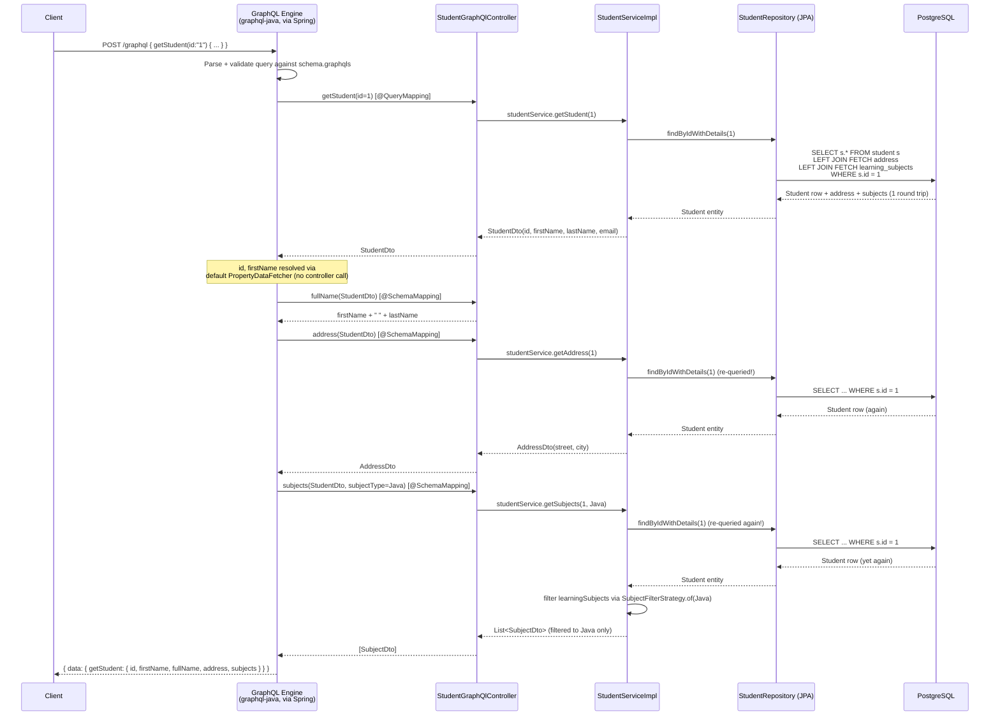
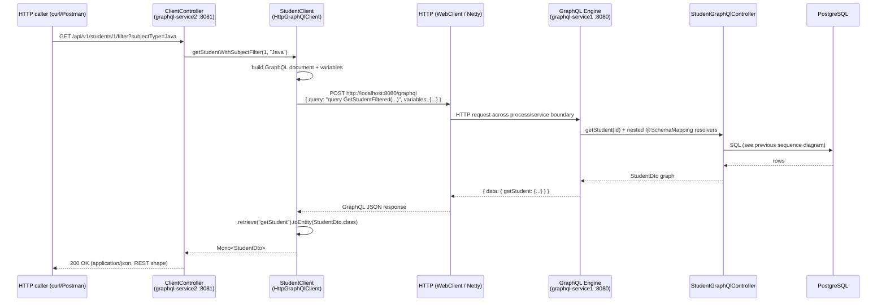

# Learning GraphQL

Production-grade Spring Boot GraphQL demo — **Spring for GraphQL**, PostgreSQL, Flyway, ShedLock, Prometheus, Grafana, TestContainers, JUnit 5.

This repository is deliberately built as **two independent Spring Boot applications** so that the same domain (a `Student` with an `Address` and `Subjects`) can be studied from both sides of a GraphQL boundary: `graphql-service1` implements the schema and resolvers (the **server**), and `graphql-service2` calls that schema over HTTP and republishes the result as plain REST (a **client** / BFF). The rest of this document is a from-the-source deep dive into how GraphQL actually works in this codebase — not just how to run it.

---

## Table of Contents

1. [Tech Stack](#tech-stack)
2. [Project Structure](#project-structure)
3. [Design Patterns (Gang of Four)](#design-patterns-gang-of-four)
4. [What GraphQL Is, and How It Differs From REST](#what-graphql-is-and-how-it-differs-from-rest)
5. [The Schema, Field by Field](#the-schema-field-by-field)
6. [Schema Type Relationships (ER Diagram)](#schema-type-relationships-er-diagram)
7. [How Spring for GraphQL Wires a Schema to Code](#how-spring-for-graphql-wires-a-schema-to-code)
8. [Resolver Architecture in This Codebase](#resolver-architecture-in-this-codebase)
9. [Query Execution Walkthrough (Sequence Diagram)](#query-execution-walkthrough-sequence-diagram)
10. [The N+1 Problem, and Whether DataLoader Is Used Here](#the-n1-problem-and-whether-dataloader-is-used-here)
11. [How the Two Services Relate](#how-the-two-services-relate)
12. [Error Handling](#error-handling)
13. [Quick Start](#quick-start)
14. [GraphQL API Reference](#graphql-api-reference)
15. [REST API (Service 2 — GraphQL Client)](#rest-api-service-2--graphql-client)
16. [ShedLock Distributed Scheduling](#shedlock-distributed-scheduling)
17. [Observability](#observability)

---

## Tech Stack

| Layer              | Technology                              |
|--------------------|------------------------------------------|
| Language           | Java 25 (virtual threads)               |
| Framework          | Spring Boot 4.1.0                       |
| GraphQL            | Spring for GraphQL (spring-graphql)     |
| Database           | PostgreSQL 16                           |
| Migrations         | Flyway                                  |
| Distributed Locks  | ShedLock 7.7.0 (JDBC provider)          |
| Observability      | Micrometer + Prometheus + Grafana       |
| Testing            | JUnit 5, TestContainers                 |
| Build              | Maven 3.9+                              |

---

## Project Structure

```
learning-graphql/
├── docker-compose.yml              # PostgreSQL + Prometheus + Grafana
├── docker/
│   ├── prometheus/prometheus.yml
│   └── grafana/provisioning/
├── insomnia-collection.json        # API test collection
│
├── graphql-service1/               # GraphQL SERVER (port 8080)
│   └── src/main/
│       ├── java/com/org/graphql/
│       │   ├── controller/         # @QueryMapping, @MutationMapping, @SchemaMapping
│       │   ├── entity/             # JPA entities (Jakarta EE)
│       │   ├── enums/              # SubjectEnum
│       │   ├── exception/          # StudentNotFoundException, GraphQlExceptionHandler
│       │   ├── mapper/             # StudentMapper (Factory Method pattern)
│       │   ├── model/              # Java 25 records (DTOs + Input types)
│       │   ├── repository/         # Spring Data JPA
│       │   ├── scheduler/          # ShedLock scheduled tasks (Template Method)
│       │   ├── service/            # StudentService, AuthorService
│       │   └── strategy/           # SubjectFilterStrategy (Strategy pattern)
│       └── resources/
│           ├── graphql/schema.graphqls
│           └── db/migration/       # Flyway V1–V3
│
└── graphql-service2/               # GraphQL CLIENT (port 8081)
    └── src/main/
        ├── java/com/org/graphql/
        │   ├── client/             # HttpGraphQlClient-based StudentClient
        │   ├── config/             # GraphQLClientConfig
        │   └── controller/         # REST → GraphQL proxy (reactive)
        └── resources/
```

---

## Design Patterns (Gang of Four)

| Pattern         | Where Applied                                                       |
|-----------------|-----------------------------------------------------------------------|
| Factory Method  | `StudentMapper.toDto()`, `SubjectFilterStrategy.of()`               |
| Template Method | `AbstractScheduler.executeScheduledTask()` → `performTask()`        |
| Strategy        | `SubjectFilterStrategy` — pluggable subject filtering               |
| Builder         | Lombok `@Builder` on entities; Java 25 record pattern on DTOs       |
| Singleton       | Spring `@Bean` singletons for all services, repositories, configs   |

---

## What GraphQL Is, and How It Differs From REST

GraphQL is a **query language for APIs** plus a server-side runtime for executing those queries against a **type system** that you define for your data (the *schema*). It was designed by Facebook to solve two chronic REST problems: **over-fetching** (a REST response returns whatever fields the endpoint author decided to include, whether the client needs them or not) and **under-fetching** (assembling a single UI view often means calling several REST endpoints and stitching the responses together on the client).

The concrete differences you can see by comparing this repository's two halves:

| Aspect                | Traditional REST (would look like)                                    | GraphQL (as actually implemented here)                                                        |
|------------------------|-------------------------------------------------------------------------|-------------------------------------------------------------------------------------------------|
| Endpoints              | Many URLs: `/students/{id}`, `/students/{id}/address`, `/students/{id}/subjects` | **One** endpoint for everything: `POST /graphql` (see `application.yml`: `spring.graphql.path: /graphql`) |
| Shape of the response  | Fixed by the server; the client takes what it's given                  | **Chosen by the client** — a query for `{ getStudent(id:"1") { firstName } }` returns *only* `firstName`, nothing else |
| Contract               | Usually described informally (OpenAPI/Swagger, docs, tribal knowledge) | **Formally typed schema** (`schema.graphqls`), machine-readable, introspectable, validated at request time |
| Nested/related data    | Requires multiple round trips (`GET /students/1`, then `GET /addresses/5`) | Resolved **server-side in one round trip** — `address { street city }` is nested straight into the `getStudent` query |
| Versioning             | `/v1/students`, `/v2/students`, ...                                    | Schema **evolves additively** — new fields/types are added without breaking existing queries |
| Discoverability        | Read the docs / hit the endpoint and see                               | **Introspection** — the schema itself can be queried, and tools like **GraphiQL** (enabled at `/graphiql` — see `spring.graphql.graphiql.enabled: true`) auto-generate a docs explorer and autocomplete from it |
| Mutating data          | HTTP verbs (`POST`, `PUT`, `PATCH`, `DELETE`) carry the "intent"        | A single `Mutation` root type carries intent explicitly — e.g. `createStudent(student: StudentInput!): StudentDto` |

Concretely, `graphql-service2` in this repo demonstrates the "many REST endpoints in front of one GraphQL endpoint" pattern in reverse: it exposes REST routes (`GET /api/v1/students/{id}`, `GET /api/v1/students/{id}/filter`, `POST /api/v1/students`) that *each* internally send a hand-written GraphQL document to `graphql-service1`'s single `/graphql` endpoint. This is a common "backend-for-frontend" (BFF) shape: REST at the edge for simple client integration, GraphQL underneath for flexible, typed data fetching.

### Schema-first typing

Spring for GraphQL takes a **schema-first** approach (as opposed to code-first, where the schema is generated from annotated classes). The single source of truth for what the API can do lives in `graphql-service1/src/main/resources/graphql/schema.graphqls`, written in GraphQL's own Schema Definition Language (SDL). Spring Boot auto-locates it via:

```yaml
graphql:
  schema:
    locations: classpath:graphql/**
    file-extensions: .graphqls,.gql
```

Java code is written *afterwards* to satisfy that schema — every field the schema promises must have either a matching Java property/record accessor or an explicit resolver method, or the application fails to start (Spring for GraphQL validates the schema against registered resolvers at boot).

### Resolvers, in one sentence

A **resolver** (Spring calls it a *data fetcher* under the hood, wrapping GraphQL Java's `DataFetcher` interface) is simply "the function that produces the value for one field of one type." GraphQL execution is a tree walk: for every field the client asked for, the engine calls that field's resolver, and if the result is itself an object type, it recurses into that object's own fields' resolvers. This is the single most important mental model for reading the controllers in `graphql-service1` — each `@QueryMapping`/`@SchemaMapping` method is a resolver for exactly one field on exactly one type.

---

## The Schema, Field by Field

The full schema, from `graphql-service1/src/main/resources/graphql/schema.graphqls`:

```graphql
type Query {
    # Hello World examples
    helloWorld: String
    names: [String!]!
    message: Message!
    fullName(firstName: String!, lastName: String!): String
    fullNameRequestObject(request: HelloWorldInput): String

    # Student queries
    getStudent(id: ID): StudentDto

    # Author queries
    authors: [Author]!
}

type Mutation {
    createStudent(student: StudentInput!): StudentDto
}

type Message {
    id: ID!
    text: String!
}

input HelloWorldInput {
    firstName: String!
    lastName: String!
}

type StudentDto {
    id: ID
    firstName: String
    lastName: String
    fullName: String
    email: String
    address: AddressDto
    subjects(subjectType: SubjectEnum): [SubjectDto]
}

type AddressDto {
    street: String
    city: String
}

type SubjectDto {
    id: ID
    subjectName: String
    marksObtained: Float
}

enum SubjectEnum {
    All
    Java
    MySql
    MongoDB
}

input StudentInput {
    firstName: String!
    lastName: String!
    email: String!
    street: String!
    city: String!
    subjects: [SubjectInput!]!
}

input SubjectInput {
    subjectName: String!
    marksObtained: Float!
}

type Author {
    id: ID!
    name: String!
    email: String!
    posts: [Post!]!
}

type Post {
    id: ID!
    title: String!
    description: String!
    category: String!
    author: Author
}
```

Reading this SDL closely tells you a lot before you even look at Java code:

- **`Query`** is the schema's single read root — every query the API supports (`helloWorld`, `getStudent`, `authors`, etc.) is a field on this one type. There's no equivalent of "one query type per resource" the way REST has "one route per resource."
- **`Mutation`** is the single write root. This codebase defines exactly one mutation, `createStudent`, which returns the created `StudentDto` — a common GraphQL convention of "return the thing you just changed" so the client can immediately re-render it without a follow-up fetch.
- **Nullability is explicit and load-bearing.** `[String!]!` (used by `names`) means "a non-null list of non-null strings" — GraphQL will error instead of returning `null` in that list. Compare to `getStudent(id: ID): StudentDto`, where both the argument and the return type are nullable — the API is explicitly allowed to return `null` for a request with no `id`, and `StudentDto`'s own fields (`id`, `firstName`, `lastName`, ...) are *all* nullable too, meaning partial results (and partial errors, see below) are legal for that type.
- **`subjects(subjectType: SubjectEnum): [SubjectDto]` is a field with its own argument.** This is a distinctly GraphQL idiom that has no direct REST analogue: a *nested* field inside a larger response can itself take parameters, letting a client filter a sub-list (e.g. "only this student's Java marks") without a second round trip or a bespoke `?subject=` query-string endpoint.
- **`input` vs `type`.** `HelloWorldInput`, `StudentInput`, and `SubjectInput` are declared with the `input` keyword rather than `type` — GraphQL requires this distinct keyword for anything used as an argument value (as opposed to returned data), and input types cannot have their own resolvers, only plain scalar/input fields.
- **`Author`/`Post` form a two-way relationship inside the schema** (`Author.posts: [Post!]!` and `Post.author: Author`), independent of the `Student` domain — the schema is effectively hosting two unrelated demo domains (`Student`/`Address`/`Subject` and `Author`/`Post`) side by side under one `Query` root, alongside a third "hello world" teaching domain (`Message`, `fullName`, etc.).

---

## Schema Type Relationships (ER Diagram)

```mermaid
erDiagram
    Query ||--o| StudentDto : "getStudent(id)"
    Query ||--o{ Author : "authors"
    Query ||--|| Message : "message"

    Mutation ||--o| StudentDto : "createStudent(student)"

    StudentDto ||--o| AddressDto : "address"
    StudentDto ||--o{ SubjectDto : "subjects(subjectType)"
    SubjectDto }o--|| SubjectEnum : "filtered by"

    Author ||--o{ Post : "posts"
    Post }o--|| Author : "author"

    StudentInput ||--o{ SubjectInput : "subjects"
    StudentInput ..|> StudentDto : "shape mirrors, used as Mutation arg"

    StudentDto {
        ID id
        String firstName
        String lastName
        String fullName
        String email
    }
    AddressDto {
        String street
        String city
    }
    SubjectDto {
        ID id
        String subjectName
        Float marksObtained
    }
    Author {
        ID id
        String name
        String email
    }
    Post {
        ID id
        String title
        String description
        String category
    }
    StudentInput {
        String firstName
        String lastName
        String email
        String street
        String city
    }
    SubjectInput {
        String subjectName
        Float marksObtained
    }
```

Notes on reading this diagram as an ER-style chart applied to a GraphQL schema: the "relationships" here are not foreign keys, they are **fields whose resolvers return another type**. `StudentDto.address` and `Author.posts` are drawn as relationships for exactly that reason — in SDL they are ordinary fields, but at runtime each one triggers a *separate* resolver invocation, which is precisely what section 9 and 10 below walk through.

---

## How Spring for GraphQL Wires a Schema to Code

Spring for GraphQL (the `spring-boot-starter-graphql` dependency in `graphql-service1/pom.xml`) is Spring's official integration on top of the reference `graphql-java` engine. At startup it:

1. Parses every `.graphqls`/`.gql` file under `classpath:graphql/**` (configured in `application.yml`) into an in-memory schema (`GraphQLSchema`).
2. Scans all Spring `@Controller`-annotated beans for three annotations — `@QueryMapping`, `@MutationMapping`, and `@SchemaMapping` — and registers each annotated method as the `DataFetcher` for one schema field.
3. Wherever a schema field has **no** explicitly-registered method, it falls back to a `PropertyDataFetcher` that reflectively reads a same-named property/record-accessor from the parent object (this is why `StudentDto.id/firstName/lastName/email` need no controller method at all — they map straight onto the `StudentDto` Java record's own components).
4. Exposes it all over one HTTP endpoint (`/graphql`, `POST`) plus, in dev, the GraphiQL explorer UI at `/graphiql`.
5. Validates every incoming query document against the parsed schema *before* executing it — unknown fields, wrong argument types, etc. are rejected with a GraphQL-shaped error, never reaching a resolver.

This explains a subtlety visible in the code: `StudentDto` (the Java record) only has four components —

```java
public record StudentDto(Long id, String firstName, String lastName, String email) { }
```

— yet the schema's `StudentDto` type has *seven* fields (`id, firstName, lastName, fullName, email, address, subjects`). `fullName`, `address`, and `subjects` have no matching Java property, so Spring for GraphQL *requires* an explicit `@SchemaMapping` method for each of them, or schema validation fails at boot. That is exactly what `StudentGraphQlController` provides (see next section).

---

## Resolver Architecture in This Codebase

### `HelloWorldGraphQlController` — the teaching controller

Five `@QueryMapping` methods, one per top-level `Query` field, none with nested object resolution:

```java
@QueryMapping
public String helloWorld() { ... }

@QueryMapping
public MessageDto message() { ... }

@QueryMapping
public String fullName(@Argument String firstName, @Argument String lastName) { ... }
```

`@Argument` binds a GraphQL argument straight onto a Java method parameter by name (`firstName`/`lastName` here match the schema's `fullName(firstName: String!, lastName: String!)` argument names exactly). `fullNameRequestObject(@Argument HelloWorldInput request)` shows the same binding working for a whole `input` type at once, deserialized into the `HelloWorldInput` record.

### `StudentGraphQlController` — root query/mutation *and* nested field resolvers

```java
@QueryMapping
public StudentDto getStudent(@Argument Long id) {
    return studentService.getStudent(id);
}

@MutationMapping
public StudentDto createStudent(@Argument StudentInput student) {
    return studentService.createStudent(student);
}

@SchemaMapping(typeName = "StudentDto", field = "fullName")
public String fullName(StudentDto student) {
    return student.firstName() + " " + student.lastName();
}

@SchemaMapping(typeName = "StudentDto", field = "address")
public AddressDto address(StudentDto student) {
    return studentService.getAddress(student.id());
}

@SchemaMapping(typeName = "StudentDto", field = "subjects")
public List<SubjectDto> subjects(StudentDto student, @Argument SubjectEnum subjectType) {
    return studentService.getSubjects(student.id(), subjectType);
}
```

This one class demonstrates every resolver style Spring for GraphQL offers:

- **`@QueryMapping`** — root-level read (`getStudent`). Method name matches the schema field name by convention.
- **`@MutationMapping`** — root-level write (`createStudent`).
- **`@SchemaMapping(typeName = "StudentDto", field = "...")`** — a resolver for a field on a *non-root* type. The first method parameter (`StudentDto student`) is always the **parent object** — the value the engine just produced for `StudentDto` itself — from which the resolver derives the child field's value. This is GraphQL's defining execution shape: resolvers are chained, each one receiving its parent's already-resolved value.
- **Field-level `@Argument`** — `subjects(StudentDto student, @Argument SubjectEnum subjectType)` shows a nested field resolver receiving *both* its parent object and its own GraphQL argument (`subjectType`), letting `getStudent(id:"1") { subjects(subjectType: Java) { ... } }` filter subjects without a separate query.

### `AuthorGraphQlController` — a second, independent object graph

```java
@QueryMapping
public List<AuthorDto> authors() { return authorService.getAllAuthors(); }

@SchemaMapping(typeName = "Author", field = "posts")
public List<PostDto> posts(AuthorDto author) { return authorService.getPostsByAuthorId(author.id()); }

@SchemaMapping(typeName = "Post", field = "author")
public AuthorDto author(PostDto post) { return authorService.getAuthorById(post.authorId()); }
```

Backed by static in-memory `List`/`Map` data in `AuthorService` (no database at all), this exists purely to demonstrate a **bidirectional** graph — `Author → posts → Post` and `Post → author → Author` — and, as covered below, it is the part of the schema where the classic N+1 shape is easiest to see.

### Why `address`/`subjects` need controller methods but `id`/`firstName` don't

Because `StudentMapper.toDto()` builds `StudentDto` with only `(id, firstName, lastName, email)`:

```java
public static StudentDto toDto(Student student) {
    return new StudentDto(
            student.getId(), student.getFirstName(), student.getLastName(), student.getEmail());
}
```

— `address` and `subjects` are deliberately **left off** the DTO and instead resolved lazily, field-by-field, only if the client actually asked for them. This is a direct expression of GraphQL's "ask for exactly what you need" philosophy at the server-implementation level, not just the wire level: if a client sends `{ getStudent(id:"1") { firstName } }`, the `address` and `subjects` resolver methods are **never invoked at all**, and the corresponding lookups never happen.

---

## Query Execution Walkthrough (Sequence Diagram)

Representative query — a client asks for a student's basic fields, computed full name, nested address, and Java-filtered subjects, all in one request:

```graphql
{
  getStudent(id: "1") {
    id
    firstName
    fullName
    address { street city }
    subjects(subjectType: Java) { subjectName marksObtained }
  }
}
```



The diagram deliberately shows **three separate `findByIdWithDetails(1)` calls for what is, from the client's point of view, one query about one student** — this is the exact behavior in `StudentServiceImpl`: `getStudent`, `getAddress`, and `getSubjects` each independently call `studentRepository.findByIdWithDetails(id)` rather than sharing the already-loaded `Student` entity. It's harmless for a single student (constant extra cost, not proportional to list size), but it is the same *root cause* — "each field resolver fetches its own data independently" — that becomes an outright N+1 problem one level up, in the `Author`/`Post` graph. See the next section.

---

## The N+1 Problem, and Whether DataLoader Is Used Here

**The problem, in general:** in GraphQL, resolving a list of parent objects and then resolving a child field *on each one* naturally produces one query for the list plus one query *per item* for the child field — "N+1" queries for N items, instead of 2 (or 1, with a join). This is the single most infamous GraphQL server-side performance trap, because the schema encourages exactly the nesting pattern that triggers it, and it's invisible from the client's side (the query still "looks like" one request).

**Where it appears in this codebase:**

- `Query.authors` (`AuthorGraphQlController.authors()`) returns a `List<AuthorDto>` of size N in a single call.
- For **every** author in that list, the engine independently invokes `@SchemaMapping(typeName = "Author", field = "posts")` — i.e. `AuthorService.getPostsByAuthorId(author.id())` is called once per author, not once for all authors. A query like:

  ```graphql
  { authors { id name posts { title } } }
  ```

  triggers **1 call to `getAllAuthors()` + N calls to `getPostsByAuthorId()`** — textbook N+1.
- The same shape exists in reverse for `Post.author` (`AuthorService.getAuthorById(post.authorId())` called once per post).

**Confirmed by reading the code: there is no batching in this repository.** A repo-wide search for `DataLoader`, `BatchLoader`, and Spring for GraphQL's `@BatchMapping` annotation turns up **zero matches**. Every `@SchemaMapping` resolver in both `StudentGraphQlController` and `AuthorGraphQlController` resolves exactly one parent object at a time, with no request-scoped caching or batching layer in front of `AuthorService`/`StudentService`.

Two reasons this is currently "not a real production incident" in this specific repo, plus what would change that:

1. **`AuthorService` is a static in-memory `Map`**, not a database call — the N+1 pattern exists structurally, but each "extra" call costs a map lookup, not a network/DB round trip. Swap that in-memory map for, say, a JPA repository backed by a real `posts` table with a `WHERE author_id = ?` query, and the *identical* resolver code becomes N real SQL queries per `authors { posts }` request.
2. **`StudentDto.address`/`subjects` don't hit the N+1 shape at all in the current schema** — `getStudent` returns a single `StudentDto`, not a list, so "resolve a child field for every item in a list" never applies there. The redundant-refetch issue described in the previous section (querying the same row three times) is a *different*, single-item problem — solvable by caching the already-loaded `Student` on the DTO or in a request-scoped cache, not by DataLoader/batching.

**What the fix would look like, if this repo needed one:** Spring for GraphQL supports exactly this scenario via the `@BatchMapping` annotation (backed by the `org.dataloader` library under the hood). Instead of:

```java
@SchemaMapping(typeName = "Author", field = "posts")
public List<PostDto> posts(AuthorDto author) {
    return authorService.getPostsByAuthorId(author.id());
}
```

a batched version would collect *all* the author IDs the engine is currently resolving `posts` for, and answer them in one shot:

```java
@BatchMapping(typeName = "Author", field = "posts")
public Map<AuthorDto, List<PostDto>> posts(List<AuthorDto> authors) {
    // one lookup (e.g. one SQL "WHERE author_id IN (...)") for the whole batch
    return authorService.getPostsForAuthors(authors);
}
```

Spring for GraphQL transparently wires `@BatchMapping` methods into a `DataLoader` registered per-request, deduplicating and batching all invocations for that field within a single query execution — this is the standard, idiomatic way GraphQL servers solve N+1, and it is worth calling out precisely because **this codebase does not (yet) use it.**

---

## How the Two Services Relate

**They are two separate, independently-runnable Spring Boot applications — not a federated or composed GraphQL graph.** There is no Apollo Federation, no schema stitching, no `@link`/`@key` directive, and no gateway process anywhere in this repo (confirmed by grepping both modules for federation-related annotations/directives — none exist). Each module has its own `pom.xml`, its own `main()` (`GraphqlService1Application`, `GraphqlService2Application`), its own port, and its own `application.yml`.

The relationship between them is purely a **runtime HTTP client/server relationship**, and only in one direction:

- **`graphql-service1`** (port `8080`) owns the schema, the database, and every resolver. It is a complete, self-sufficient GraphQL API on its own — you could query it directly from `curl`, Postman, GraphiQL, or any GraphQL client with zero knowledge of `graphql-service2`'s existence.
- **`graphql-service2`** (port `8081`) has **no schema of its own** (its `pom.xml` even comments the dependency as `"GraphQL client (no server schema required)"`). It depends only on `spring-graphql`'s client support, not `spring-boot-starter-graphql`. At startup, `GraphQLClientConfig` builds a reactive `HttpGraphQlClient` pointed at `graphql-service1`'s endpoint via the externalized property `graphql.server.url` (defaulting to `http://localhost:8080/graphql`):

  ```java
  @Bean
  public HttpGraphQlClient graphQlClient() {
      WebClient webClient = WebClient.builder()
              .baseUrl(graphQlServerUrl)
              .defaultHeader("Content-Type", "application/json")
              .build();
      return HttpGraphQlClient.create(webClient);
  }
  ```

- `StudentClient` in `graphql-service2` then hand-writes GraphQL query/mutation documents as Java text blocks and sends them through that client, e.g.:

  ```java
  public Mono<StudentDto> getStudent(Integer id) {
      return graphQlClient
              .document("""
                      query GetStudent($id: ID!) {
                          getStudent(id: $id) {
                              id firstName lastName email
                              address { street city }
                              subjects(subjectType: All) { id subjectName marksObtained }
                          }
                      }
                      """)
              .variable("id", id.toString())
              .retrieve("getStudent")
              .toEntity(StudentDto.class);
  }
  ```

- `ClientController` (a `@RestController`) exposes plain REST routes (`GET /api/v1/students/{id}`, `GET /api/v1/students/{id}/filter`, `POST /api/v1/students`) that simply delegate to `StudentClient`, reactively (`Mono<StudentDto>`), returning the GraphQL result as a REST JSON body.

In short: **`graphql-service2` is a REST-facing gateway / BFF in front of `graphql-service1`'s GraphQL API**, useful for demonstrating what it looks like to *consume* a GraphQL API from a typed Java client, and for showing that a GraphQL backend can sit comfortably behind a conventional REST facade for callers who'd rather not speak GraphQL directly. It is not a second resolver-bearing node in the same graph.



---

## Error Handling

`GraphQlExceptionHandler` extends Spring for GraphQL's `DataFetcherExceptionResolverAdapter` to translate Java exceptions thrown inside resolvers into GraphQL-spec-shaped errors (each with a `message`, a `path` pointing at the failing field, and an `extensions.classification`):

```java
@Override
protected GraphQLError resolveToSingleError(Throwable ex, DataFetchingEnvironment env) {
    if (ex instanceof StudentNotFoundException) {
        return GraphqlErrorBuilder.newError(env)
                .errorType(ErrorType.NOT_FOUND)
                .message(ex.getMessage())
                .build();
    }
    return GraphqlErrorBuilder.newError(env)
            .errorType(ErrorType.INTERNAL_ERROR)
            .message("Internal server error")
            .build();
}
```

Because every field in `StudentDto` is nullable in the schema, a `getStudent` query that errors partway through still returns a well-formed response envelope: `data.getStudent` is `null` and the top-level `errors` array carries the `StudentNotFoundException` message — this is GraphQL's **partial response** model (`{"data": ..., "errors": [...]}` both present), distinct from REST's all-or-nothing HTTP status code per response.

---

## Quick Start

### 1. Start infrastructure

```bash
docker-compose up -d
```

| Service    | URL                                 |
|------------|--------------------------------------|
| PostgreSQL | `localhost:5432`                    |
| Prometheus | http://localhost:9091               |
| Grafana    | http://localhost:3001 (admin/admin) |

### 2. Run service1 (GraphQL server)

```bash
cd graphql-service1
mvn spring-boot:run
```

- GraphQL endpoint: http://localhost:8080/graphql
- GraphiQL IDE: http://localhost:8080/graphiql
- Actuator: http://localhost:8080/actuator

### 3. Run service2 (GraphQL client)

```bash
cd graphql-service2
mvn spring-boot:run
```

- REST API: http://localhost:8081/api/v1/students
- Actuator: http://localhost:8081/actuator

### 4. Run tests

```bash
mvn test
# Requires Docker running for TestContainers
```

---

## GraphQL API Reference

### Schema

```graphql
type Query {
    helloWorld: String
    names: [String!]!
    message: Message!
    fullName(firstName: String!, lastName: String!): String
    fullNameRequestObject(request: HelloWorldInput): String
    getStudent(id: ID): StudentDto
    authors: [Author]!
}

type Mutation {
    createStudent(student: StudentInput!): StudentDto
}
```

### Example Queries

**Get student with all fields:**
```graphql
{
    getStudent(id: "1") {
        id firstName lastName fullName email
        address { street city }
        subjects(subjectType: All) { subjectName marksObtained }
    }
}
```

**Get student with subject filter:**
```graphql
{
    getStudent(id: "2") {
        firstName
        subjects(subjectType: Java) { subjectName marksObtained }
    }
}
```

**Create student:**
```graphql
mutation CreateStudent($student: StudentInput!) {
    createStudent(student: $student) {
        id firstName lastName fullName email
        address { street city }
        subjects(subjectType: All) { subjectName marksObtained }
    }
}
```

Variables:
```json
{
    "student": {
        "firstName": "Alice",
        "lastName": "Walker",
        "email": "alice@example.com",
        "street": "Baker St",
        "city": "London",
        "subjects": [
            { "subjectName": "Java", "marksObtained": 95.0 }
        ]
    }
}
```

**Get authors with posts:**
```graphql
{
    authors { id name email posts { id title description category } }
}
```

**Get a student that does not exist (partial-response / error demo):**
```graphql
{ getStudent(id: "9999") { firstName } }
```
Returns `data.getStudent: null` plus a populated top-level `errors` array (see [Error Handling](#error-handling)).

---

## REST API (Service 2 — GraphQL Client)

| Method | Path                              | Description                                   |
|--------|-------------------------------------|--------------------------------------------------|
| GET    | `/api/v1/students/{id}`           | Fetch student via GraphQL client              |
| GET    | `/api/v1/students/{id}/filter`    | Fetch with subject filter `?subjectType=Java` |
| POST   | `/api/v1/students`                | Create student via GraphQL mutation           |

Each of these routes is a thin `ClientController` handler that delegates straight to `StudentClient`, which in turn sends a fixed GraphQL document (see [How the Two Services Relate](#how-the-two-services-relate)) to `graphql-service1` over HTTP and reactively maps the JSON response into `StudentDto`.

---

## ShedLock Distributed Scheduling

- `StudentReportScheduler` runs every 5 minutes (configurable) and is protected by ShedLock
- ShedLock prevents concurrent execution across multiple instances — only one node runs per cron tick
- Lock configuration is driven by YAML properties, not hardcoded annotation values

```yaml
shedlock:
  default-lock-at-most-for: 30s
  default-lock-at-least-for: 10s
  student-report:
    cron: "0 */5 * * * *"
```

- The `shedlock` table is created by Flyway migration `V3__create_shedlock_table.sql`
- Lock records include `lock_until`, `locked_at`, and `locked_by` (hostname:port) columns

---

## Observability

- **Actuator endpoints:** `/actuator/health`, `/actuator/info`, `/actuator/metrics`, `/actuator/prometheus`
- **Prometheus:** Scrapes both services at http://localhost:9091
- **Grafana:** Pre-configured Prometheus datasource at http://localhost:3001
- Import a Spring Boot dashboard (e.g. Grafana dashboard ID **19004**) to get JVM, HTTP, and Hikari metrics out of the box
